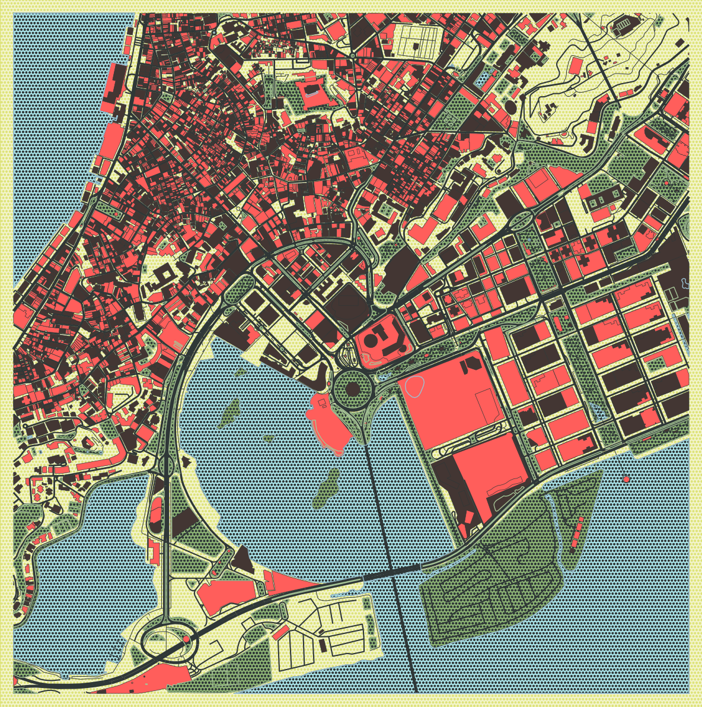
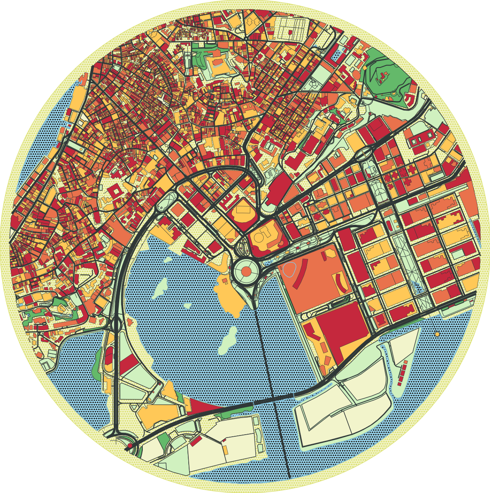
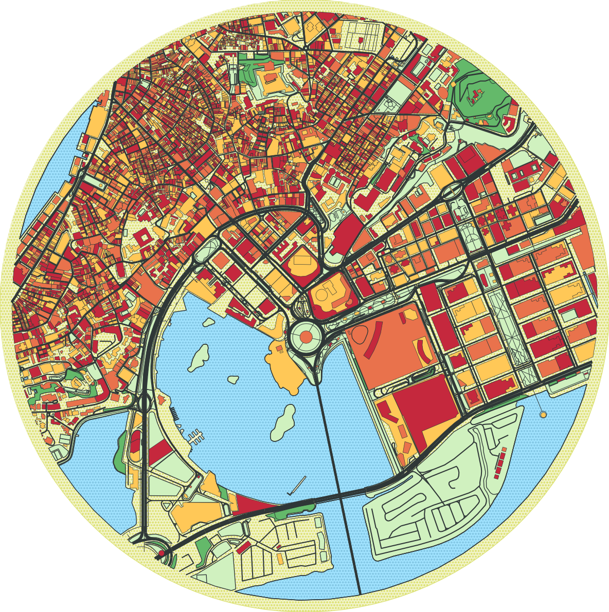
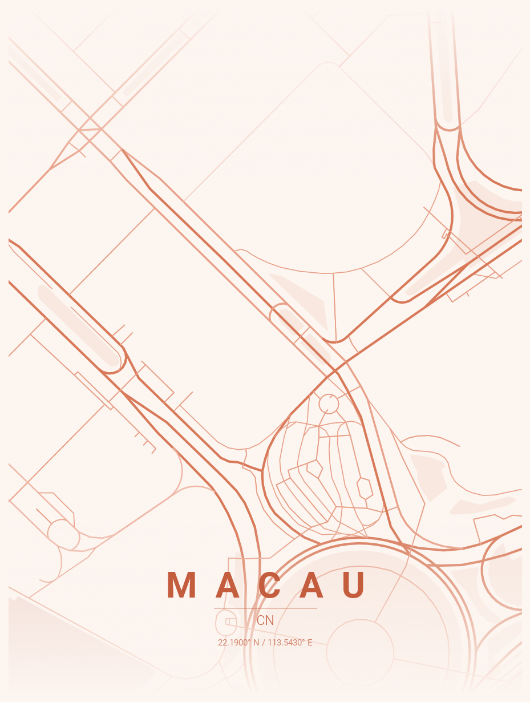
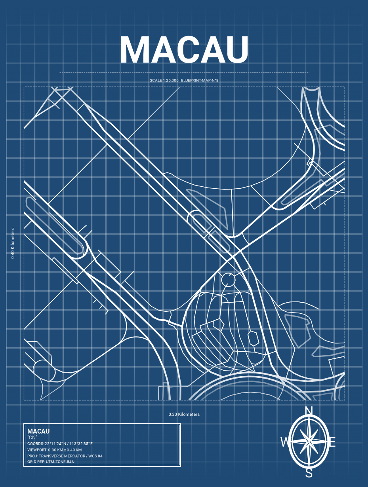
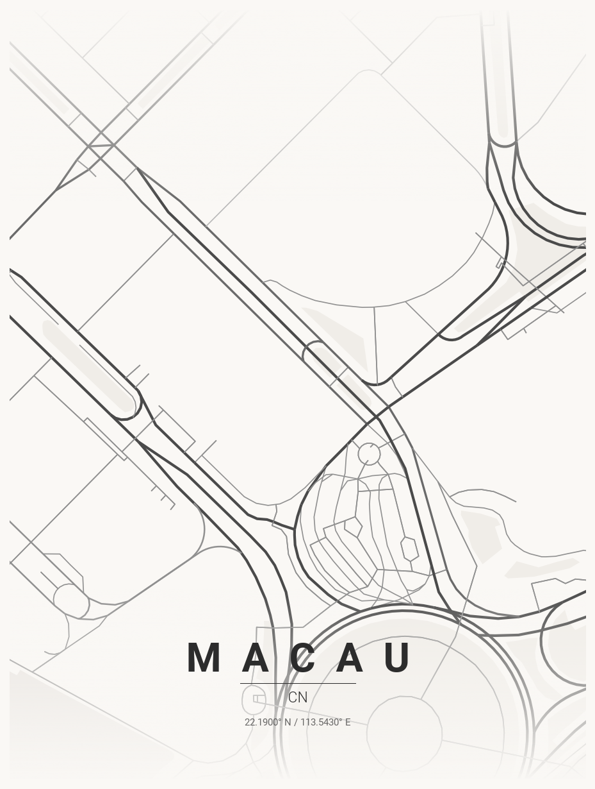

# GeoCanvas - City Map & Poster Generator

Generate beautiful, minimalist map posters and vector maps for any city in the world using OpenStreetMap data.

### Classic Vector Style Examples

<p align="center">
  
  
  
</p>

### Poster Artwork Style Examples

<p align="center">
  
  
  
 
</p>

---

## Features

- High Performance: Fast geometry extraction and Matplotlib collection rendering for quick map generation.
- Interactive Map Selection: Click and select locations, coordinates, or bounding regions directly on an interactive map picker.
- 40+ Color Themes: Includes Classic vector themes (Peach, Auburn, Citrus, Flannel, Barcelona, Macao) and 30+ Poster themes (terracotta, midnight_blue, neon_cyberpunk, japanese_ink, blueprint_classic, etc.).
- Interactive Web Studio: Streamlit application with live previews, custom controls, theme image selection, and SVG/PNG export.
- Unified Command Line Generator: Single CLI (`cli/generate.py`) for generating both Classic vector maps and print-ready poster artwork.
- Multilingual and Custom Fonts: Automatic Google Fonts downloading and embedding for native character rendering (Japanese, Korean, Chinese, Arabic, Cyrillic, etc.).
- Regional Boundary Posters: Create country, state, or province maps with watercolor shading and procedural paper textures.
- Containerized Deployment: Dockerfile included for quick cloud or local container deployment.

---

## Installation

### With uv (Recommended)

Make sure [uv](https://docs.astral.sh/uv/) is installed. Running scripts with `uv` automatically manages dependencies and virtual environments.

```bash
git clone https://github.com/chrieke/prettymapp.git
cd prettymapp

# Sync dependencies (including Streamlit app extras)
uv sync --extra streamlit
```

### With pip + venv

```bash
python -m venv .venv
source .venv/bin/activate  # On Windows: .venv\Scripts\activate
pip install -e .[streamlit]
```

### With Docker

Build and run the Streamlit web studio inside a isolated Docker container:

```bash
# Build the Docker image
docker build -t prettymapp .

# Run container on port 8501
docker run -p 8501:8501 prettymapp
```

---

## Usage

### 1. Interactive Streamlit Web Application

Launch the local interactive studio:

```bash
uv run streamlit run streamlit-prettymapp/app.py
```

Open `http://localhost:8501` in your browser to access:
- Interactive Location Selection: Search by city name or click directly on the interactive Leaflet map picker to set center coordinates and radius.
- Visual Theme Selector: Browse visual thumbnail galleries for both Classic vector styles and 30+ Poster themes.
- Custom Layout Controls: Fine-tune map shapes (circle, rectangle), contour line widths, background colors, building layer toggles, and typography.
- High-Resolution Export: Save rendered artwork as high-res PNG or vector SVG files.

---

### 2. Unified CLI Generator & Interactive Studio (cli/generate.py)

Generate maps directly from the terminal without running a server.

#### Interactive Keyboard Terminal Studio (--run_cli / --cli)

Launch the interactive step-by-step terminal studio featuring arrow-key keyboard navigation and ANSI color highlights:

```bash
# Launch interactive keyboard TUI studio
uv run python generate.py --run_cli
# or
uv run python cli/generate.py --cli
```

Interactive Terminal Studio Features:
- Arrow-Key Navigation: Navigate menu selections using UP and DOWN arrow keys, then press ENTER to confirm.
- Guided 6-Step Wizard: Configures Style Mode, Location / Coordinates, Theme preset (scrollable list of 30+ palettes), Map distance scale, Typography, and Output file targets.
- Colorized Confirmation Summary: Displays a summary card before initializing rendering.

#### Direct Command-Line Flags

```bash
# Direct poster artwork generation
uv run python cli/generate.py --city "Paris" --country "France" --style poster --theme terracotta

# Direct classic vector map rendering
uv run python cli/generate.py --location "Rome, Italy" --style classic --theme Auburn --shape circle --contour-width 3

# Using exact coordinates (latitude & longitude)
uv run python cli/generate.py --latitude 41.8902 --longitude 12.4922 --radius 1500 --style classic --theme Peach --output "output/colosseum.png"
```

#### CLI Command Options

| Option | Short | Description | Default |
|---|---|---|---|
| `--run_cli` | `--cli` | Launch interactive step-by-step terminal wizard | `False` |
| `--style` | `-s` | Map style mode (`classic` or `poster`) | `classic` |
| `--location` | `-l` | Location address string (e.g. "Paris, France") | None |
| `--city` | `-c` | City name for geocoding & poster title | None |
| `--country` | `-C` | Country name for geocoding & poster subtitle | None |
| `--latitude` | `-lat` | Latitude center coordinate override | None |
| `--longitude` | `-long` | Longitude center coordinate override | None |
| `--radius` | `-r`, `-d` | Map radius / distance in meters | `1200` |
| `--theme` | `-t` | Theme preset name | Mode default |
| `--title` | `-dc` | Custom map title text | City name |
| `--subtitle` | `-dC` | Custom map subtitle text (Poster mode) | Country name |
| `--font-family` | | Google Fonts family name (e.g. `Noto Sans JP`) | Default font |
| `--shape` | | Map shape contour (`circle`, `rectangle`) | `circle` |
| `--contour-width` | | Border contour line width (Classic mode) | `0` |
| `--contour-color` | | Border contour color hex code (Classic mode) | `#2F3537` |
| `--bg-shape` | | Background shape (`rectangle`, `circle`, `none`) | `rectangle` |
| `--bg-color` | | Background hex color code | `#F2F4CB` |
| `--width` | `-W` | Image width in inches | `12.0` |
| `--height` | `-H` | Image height in inches | `16.0` |
| `--output` | `-o` | Output file path | Auto-generated |
| `--list-themes` | | Print all available Classic and Poster themes | |

---

### Multilingual Support (i18n)

Display city and country names in native non-Latin scripts using Google Fonts:

```bash
# Japanese
uv run python cli/generate.py -c "Tokyo" -C "Japan" --title "東京" --subtitle "日本" --font-family "Noto Sans JP" -s poster -t japanese_ink

# Korean
uv run python cli/generate.py -c "Seoul" -C "South Korea" --title "서울" --subtitle "대한민국" --font-family "Noto Sans KR" -s poster -t midnight_blue

# Thai
uv run python cli/generate.py -c "Bangkok" -C "Thailand" --title "กรุงเทพมหานคร" --subtitle "ประเทศไทย" --font-family "Noto Sans Thai" -s poster -t sunset

# Arabic
uv run python cli/generate.py -c "Dubai" -C "UAE" --title "دبي" --subtitle "الإمارات" --font-family "Cairo" -s poster -t terracotta

# Chinese (Simplified)
uv run python cli/generate.py -c "Beijing" -C "China" --title "北京" --subtitle "中国" --font-family "Noto Sans SC" -s poster
```

---

### Resolution Guide (300 DPI)

Use these values for `-W` and `-H` to target specific image resolutions:

| Target | Resolution (px) | Inches (-W / -H) |
|---|---|---|
| Instagram Post | 1080 x 1080 | 3.6 x 3.6 |
| Mobile Wallpaper | 1080 x 1920 | 3.6 x 6.4 |
| HD Wallpaper | 1920 x 1080 | 6.4 x 3.6 |
| 4K Wallpaper | 3840 x 2160 | 12.8 x 7.2 |
| A4 Print | 2480 x 3508 | 8.3 x 11.7 |

---

### Distance Guide

| Distance (-r / -d) | Best for |
|---|---|
| 4000-6000m | Small / dense historic centers (Venice, Amsterdam center) |
| 8000-12000m | Medium cities, downtown focus (Paris, Barcelona) |
| 15000-20000m | Large metros, full city view (Tokyo, Mumbai) |

---

## Adding Custom Themes

### 1. Poster Themes (JSON)

To create a new poster theme, create a `.json` file inside `poster_generator/themes/`:

```json
{
  "name": "My Custom Theme",
  "description": "Dark midnight palette with metallic copper roads",
  "bg": "#0D1117",
  "text": "#F0F6FC",
  "gradient_color": "#0D1117",
  "water": "#161B22",
  "parks": "#21262D",
  "road_motorway": "#D29922",
  "road_primary": "#E3B341",
  "road_secondary": "#F0883E",
  "road_tertiary": "#8B949E",
  "road_residential": "#484F58",
  "road_default": "#30363D"
}
```

The theme will automatically be detected by `load_theme()` and appear in `--list-themes` and the Streamlit web studio.

### 2. Classic Themes (Python Dictionary)

Add a custom dictionary preset to `prettymapp/settings.py` under `STYLES`:

```python
STYLES["CustomTheme"] = {
    "building": {"tags": {"building": True}, "cmap": ["#3452eb"], "ec": "#1A1A1A", "lw": 0.2, "zorder": 4},
    "water": {"tags": {"natural": ["water", "bay"]}, "cmap": ["#7BBBA6"], "ec": "none", "zorder": 1},
    "parks": {"tags": {"leisure": "park"}, "cmap": ["#A6B093"], "ec": "none", "zorder": 2},
}
```

---

## Developer & Hacker's Guide

Quick reference for developers extending or modifying the codebase.

### Project Structure

```text
custom_map_generator/
├── cli/
│   └── generate.py
├── poster_generator/
│   ├── create_boundary_poster.py
│   ├── create_map_poster.py
│   ├── font_management.py
│   ├── fonts/
│   │   ├── Roboto-Bold.ttf
│   │   ├── Roboto-Light.ttf
│   │   └── Roboto-Regular.ttf
│   └── themes/
│       ├── autumn.json
│       ├── blueprint_classic.json
│       ├── japanese_ink.json
│       ├── neon_cyberpunk.json
│       ├── terracotta.json
│       └── ... (30+ theme configuration files)
├── prettymapp/
│   ├── geo.py
│   ├── osm.py
│   ├── plotting.py
│   ├── settings.py
│   └── fonts/
│       └── PermanentMarker-Regular.ttf
├── streamlit-prettymapp/
│   ├── app.py
│   ├── utils.py
│   ├── examples.json
│   └── assets/
│       └── themes/
├── generate.py
├── pyproject.toml
├── uv.lock
├── README.md
├── Dockerfile
├── LICENSE
└── Makefile
```

### Architecture Overview

```text
┌─────────────────────────────────────────────────────────────────────────┐
│                           USER INTERFACES                               │
├─────────────────────────────────────────┬───────────────────────────────┤
│    Streamlit Web Studio (app.py)        │   CLI Generator (generate.py) │
│  • Interactive Map Location Selector    │  • Command Line Parser        │
│  • Visual Theme & Image Selectors       │  • Classic & Poster Modes     │
│  • Realtime Preview & SVG/PNG Export    │  • Batch & Script Automation  │
└────────────────────┬────────────────────┴──────────────┬────────────────┘
                     │                                   │
                     ▼                                   ▼
┌─────────────────────────────────────────────────────────────────────────┐
│                      GEOCODING & LOCATION RESOLUTION                    │
│  • Nominatim Geocoding API / OSMnx ox.geocode()                          │
│  • Interactive Map Coordinate Selection (Point & Bounding Polygon)      │
│  • Local UTM Projected CRS Buffer Calculation (prettymapp.geo)          │
└────────────────────────────────────┬────────────────────────────────────┘
                                     │
                                     ▼
┌─────────────────────────────────────────────────────────────────────────┐
│                     OSM DATA FETCHING & CACHING                         │
│  • Overpass API Querying via OSMnx (prettymapp.osm)                     │
│  • Feature Tagging: Water, Parks, Landuse, Buildings, Roads, Transit    │
│  • Serialized Local Pickle Caching for Fast Re-rendering                │
└────────────────────────────────────┬────────────────────────────────────┘
                                     │
                                     ▼
┌─────────────────────────────────────────────────────────────────────────┐
│                          RENDERING ENGINES                              │
├─────────────────────────────────────────┬───────────────────────────────┤
│   Classic Vector Engine (plotting.py)   │   Poster Engine (create_map)  │
│  • PatchCollection / LineCollection     │  • Road Hierarchy & DMS Text  │
│  • Circle / Rectangle Contours & Fill   │  • Compass Rose & Typography  │
│  • Custom Palette Vector Styling        │  • Google Fonts i18n & Filter │
└────────────────────┬────────────────────┴──────────────┬────────────────┘
                     │                                   │
                     ▼                                   ▼
┌─────────────────────────────────────────────────────────────────────────┐
│                           FINAL OUTPUT                                  │
│                 High-Res PNG / Vector SVG File Export                   │
└─────────────────────────────────────────────────────────────────────────┘
```

### Key Functions

| Function | Purpose | Location |
|---|---|---|
| `prettymapp.geo.get_aoi()` | Geocodes location or point to local UTM buffered polygon | `prettymapp/geo.py` |
| `prettymapp.osm.get_osm_geometries()` | Queries Overpass API for tagged OSM features | `prettymapp/osm.py` |
| `prettymapp.plotting.Plot()` | Main vector collection rendering class | `prettymapp/plotting.py` |
| `create_poster()` | Main poster rendering pipeline | `poster_generator/create_map_poster.py` |
| `create_boundary_poster()` | Regional boundary & watercolor ocean generator | `poster_generator/create_boundary_poster.py` |
| `get_edge_colors_by_type()` | Maps OSM highway tags to road colors | `poster_generator/create_map_poster.py` |
| `get_edge_widths_by_type()` | Maps road importance to line weights | `poster_generator/create_map_poster.py` |
| `download_google_font()` | Fetches and caches Google Fonts | `poster_generator/font_management.py` |

### Rendering Layers (z-order)

```text
z=11  Text labels (city, country, coordinates)
z=10  Gradient fades (top & bottom)
z=9   Motorways & Primary Highways
z=8   Secondary Highways
z=7   Tertiary Roads
z=6   Residential & Minor Streets
z=5   Transit Lines (railways, subways)
z=4   Building Footprints
z=3   Pedestrian & Urban Plazas
z=2   Parks, Forests & Green Spaces
z=1   Water Bodies (rivers, oceans, lakes)
z=0   Background Color / Paper Mask
```

### Road Hierarchy Mapping

In `get_edge_colors_by_type()` and `get_edge_widths_by_type()`:

```python
motorway, motorway_link     -> Thickest linewidth (1.2), primary theme color
trunk, primary, primary_link -> Thick linewidth (1.0), primary theme color
secondary, secondary_link   -> Medium linewidth (0.8), secondary theme color
tertiary, tertiary_link     -> Thin linewidth (0.6), tertiary theme color
residential, living_street  -> Thinnest linewidth (0.4), residential theme color
```

### Typography Positioning Math

All poster typography elements use `transform=ax.transAxes` (normalized 0.0 to 1.0 canvas coordinates):

```text
y = 0.14   City name label (with letter spacing for Latin scripts)
y = 0.125  Horizontal decorative divider line
y = 0.10   Country name label
y = 0.07   DMS coordinates string (e.g. 40°42'46" N / 74°00'22" W)
y = 0.02   OpenStreetMap attribution credit (bottom right)
```

### Useful OSMnx Code Patterns for Extending Layers

Querying custom features (e.g., railway transit, amenities, building footprints):

```python
# 1. Fetch railway transit infrastructure
railways = ox.features_from_point(point, tags={'railway': ['subway', 'light_rail', 'tram']}, dist=dist)
if railways is not None and not railways.empty:
    railways = railways.to_crs(g_proj.graph["crs"])
    railways.plot(ax=ax, color=THEME.get('transit', '#FF0000'), linewidth=0.8, zorder=5)

# 2. Fetch specific amenity POIs
cafes = ox.features_from_point(point, tags={'amenity': 'cafe'}, dist=dist)

# 3. Query network graph for specific travel modes
G_bike = ox.graph_from_point(point, dist=dist, network_type='bike')
G_walk = ox.graph_from_point(point, dist=dist, network_type='walk')
```

### Performance Optimization Guidelines

- Keep map radius (`-r` / `-d`) under 15,000m for fast downloads. Radii above 20,000m query large Overpass datasets and require more memory.
- Geocoding and street network pickle files are cached locally under `cache/` and `poster_generator/cache/` to eliminate duplicate API requests.
- Pass `network_type='drive'` instead of `'all'` for faster street network downloads.
- Reduce rendering DPI from 300 to 150 during local development for rapid iteration.

---

## Troubleshooting & FAQ

- **Geocoding Timeouts or Nominatim Limits**:
  If Nominatim rate limits or times out, pass exact coordinates via `--latitude` (`-lat`) and `--longitude` (`-long`).

- **Non-Latin Characters Rendering Blank or Boxes**:
  Ensure you specify an appropriate Google Font family using `--font-family` (e.g. `--font-family "Noto Sans JP"` for Japanese, `--font-family "Cairo"` for Arabic).

- **High Memory Usage on Large Cities**:
  Reduce the radius distance (`--radius 5000`) or disable building footprints (`--no-buildings`).

---

## Acknowledgments & Credits

This project incorporates code, themes, and design concepts from the following open-source projects:

- **[maptoposter](https://github.com/originalankur/maptoposter)** created by Ankur Gupta ([@originalankur](https://github.com/originalankur)): For the city map poster generator engine, 30+ curated color themes, regional boundary posters, and multilingual Google Fonts integration.
- **[prettymaps](https://github.com/marceloprates/prettymaps)** created by [@marceloprates](https://github.com/marceloprates): For the original vector map rendering concept and aesthetic layout inspiration.

---

## License

[MIT License](LICENSE)